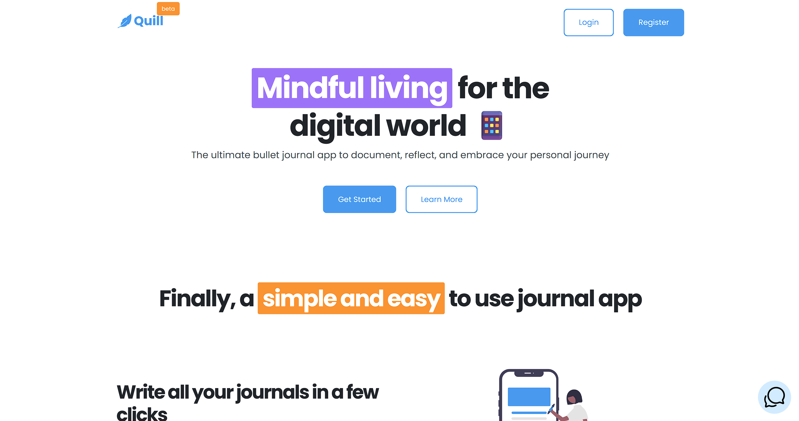

# Quill HomePage

A clean and modern homepage UI built using **HTML** and **CSS**. This project focuses on creating a visually appealing landing page layout inspired by contemporary product and SaaS websites. It includes structured sections, responsive design elements, and neatly organized code to help beginners and frontend learners understand layout building from scratch.

## 🚀 Features

* Fully responsive homepage layout
* Clean and modern UI/UX
* Pure **HTML + CSS** (no frameworks)
* Well-structured components for easy customization
* Suitable for portfolio, product landing pages, or website templates

## 📁 Tech Stack

* **HTML5**
* **CSS3**

## 📂 Project Structure

```
/project-root
│— index.html
│— style.css
│— assets/ (images, icons, etc.)
```

## 🎯 Purpose of the Repository

This repository is designed for practicing and showcasing frontend design skills. It demonstrates how to build a complete homepage layout using only core web technologies without relying on third-party UI frameworks.

## 🔧 How to Use

1. Clone the repository:

   ```bash
   git clone https://github.com/yashuyouwaraj/Quill-HomePage.git
   ```
2. Open `index.html` in your browser.
3. Customize the UI or extend the layout as needed.

## 📸 Preview

